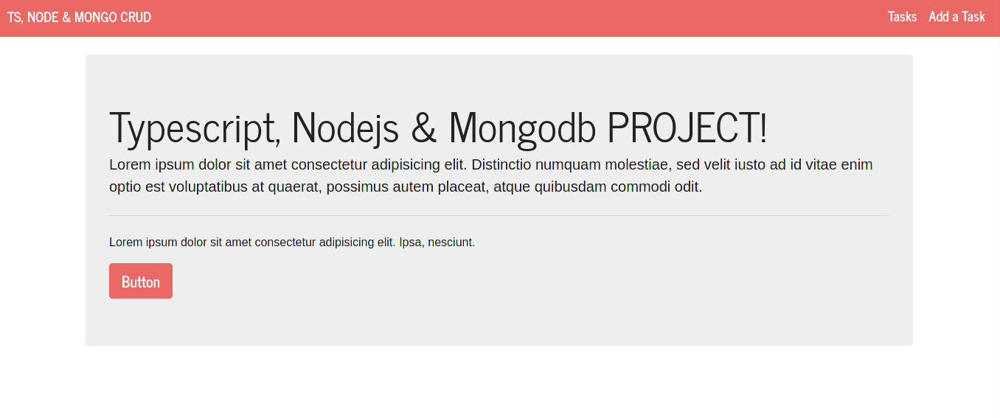

# TYPESCRIPT, NODEJS & MONGODB PHOTO GALLERY :rocket:

This is a REST API using typescript, nodejs, mongodb, uuid, multer.
You can upload an image and then the title, description and an image path is stored in mongodb database, the image itself is stored in the server.

## What Does this API ?

- Save (title, description and an image path) in mongodb.
- Delete an image by id.
- Update image data (title, description).
- Recovery all the images stored in the databases (server).

## Technologies used for this project :computer:

- [typescript](https://www.typescriptlang.org/)
- [nodejs](https://nodejs.org/en/)
- [mongodb](https://nodejs.org/en/)

## Screenshots :camera:



## Installation

> The database (mongo) must be have running at port 27017 (default port)

You can use a client app like [insomnia](https://www.insomnia.rest) or a fronted app for test the app.

```cmd
git clone https://github.com/gabrielba15/typescript-nodejs-mongodb-restapi-photo-gallery.git
cd typescript-nodejs-mongodb-restapi-photo-gallery.git
npm install 
npm run build 
npm start
```

> Ready, happy hacking :D
